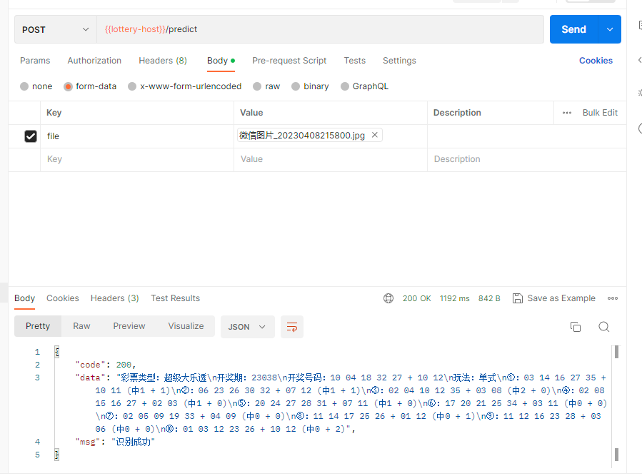

# 简介
拍照/上传图片识别彩票中奖内容 Uniapp小程序  


彩票图片支持：<br>支持体彩超级大乐透和福彩双色球，支持单式、复式、胆拖玩法。


基础的模板，功能简单，没有第三方插件   
首页：  
图片上传，展示，分享（支付宝平台），结果展示  
用户中心：  
帮助信息，提交意见反馈 
 
只使用了两个请求  需要更改HTTP请求，APPID 开启调试

想写个demo拿去提审，发现个人开发者不支持这个行业目录，干脆开源了，赞人气


# 界面


# 前端 
默认模板 来测试支付宝平台能力
```
npm  install 

```
最初是向上到支付宝
```
npm run dev:mp-alipay

```
```
npm run build:mp-alipay
```

# 后端：


后端服务：registry.cn-shenzhen.aliyuncs.com/koala9527/hello-lottery-small  （10G，因为包含模型文件，pytorch包也特别大）  


自己使用flask 增加了一个接口：




想修改参考：https://github.com/wushidiguo/hello-lottery

